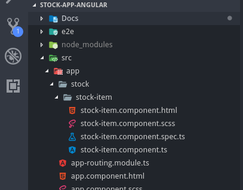

## Angular Facts
---

### Separation of Concerns


### Code Snippets

```
ng generate component stock/stock-item
```

The above style is the default practice. This will create the following structure in the file folder hierarchy. This will generate the default component (in this case) structure through above Angular CLI command.



